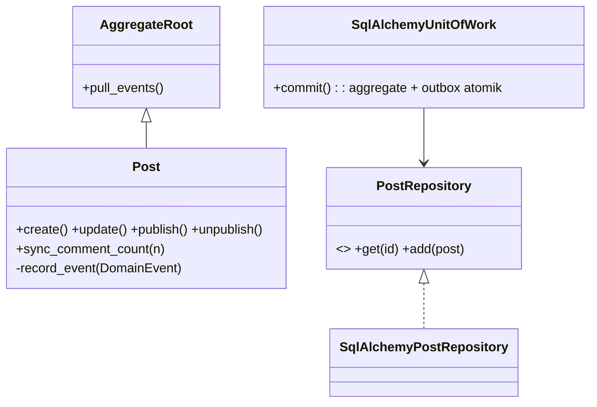
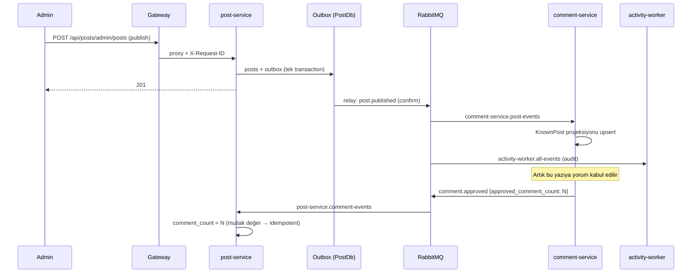
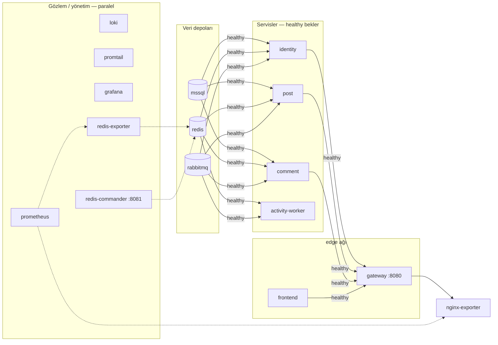

# DevBlog — Mimari Doküman

## 1. Genel bakış

```
                              ┌──────────────────────────────┐
     Tarayıcı ──HTTPS──▶      │  Ingress (prod) / :8080 (dev) │
                              └──────────────┬───────────────┘
                                             ▼
                     ┌───────────────────────────────────────────────┐
                     │           NGINX API GATEWAY                   │
                     │  rate limit · CSP/HSTS · X-Request-ID · gzip  │
                     │  JSON access log · /metrics kapalı            │
                     └───┬──────────┬────────────┬──────────┬────────┘
            /api/identity│ /api/posts│ /api/comments│         │ /*
                         ▼           ▼            ▼          ▼
                 ┌────────────┐┌────────────┐┌─────────────┐┌──────────┐
                 │ identity   ││   post     ││  comment    ││ frontend │
                 │ service    ││  service   ││  service    ││ (SPA)    │
                 └─┬───┬───┬──┘└─┬───┬───┬──┘└─┬───┬───┬───┘└──────────┘
                   │   │   │     │   │   │     │   │   │
              ┌────┘   │   └──┐  │   │   │  ┌──┘   │   └────┐
              ▼        ▼      │  ▼   │   │  │      ▼        ▼
         IdentityDb  Redis ◀──┼──────┘   │  │   CommentDb  Redis
         (MSSQL)     (cache,  │  PostDb  │  │   (MSSQL)
                     revoke,  │ (MSSQL)  │  │
                     ratelim) ▼          ▼  ▼
                     ┌────────────────────────────────────┐
                     │ RabbitMQ  exchange: devblog.events │──▶ activity-worker
                     │ (topic) + DLX devblog.events.dlx   │    (audit, bildirim)
                     └────────────────────────────────────┘
     Gözlemlenebilirlik: servis /metrics → Prometheus → Grafana ◀── Loki ◀── Promtail (stdout JSON)
```

| Servis | Sorumluluk (Bounded Context) | Veritabanı |
|---|---|---|
| identity-service | Kimlik, JWT, refresh token rotasyonu, giriş kilidi | IdentityDb |
| post-service | Yazı, kategori, etiket, okuma sayacı, arama | PostDb |
| comment-service | Yorum, moderasyon, spam koruması | CommentDb |
| activity-worker | Tüm event'lerin audit logu, bildirim | — |
| gateway | Yönlendirme, güvenlik başlıkları, rate limit | — |
| frontend | React SPA (Bootstrap 5) | — |

## 2. Klasör yapısı

```
devblog/
├── libs/py-common/devblog_common/   # Shared kernel (yalnızca altyapı yapı taşları, iş kuralı YOK)
│   ├── domain.py                    # AggregateRoot, DomainEvent, hata hiyerarşisi
│   ├── persistence/                 # UnitOfWork, Outbox + Relay, ensure_database
│   ├── messaging/                   # topology (tek doğruluk kaynağı), publisher, consumer, envelope
│   ├── web/                         # app factory, middleware, RFC7807 hatalar, JwtVerifier
│   ├── cache.py  backoff.py  logging.py  correlation.py  config.py
├── services/<servis>/
│   ├── app/
│   │   ├── domain/                  # Aggregate'ler, value object'ler, repository port'ları
│   │   ├── application/             # Command/Query handler'ları, DTO, arayüzler (Protocol)
│   │   ├── infrastructure/          # SQLAlchemy, Redis, güvenlik adapter'ları
│   │   ├── api/                     # FastAPI router, şema, dependency
│   │   ├── container.py             # Composition root (DI)
│   │   └── main.py                  # Uygulama + lifespan
│   ├── tests/{unit,integration}/
│   └── requirements.txt
├── frontend/src/
│   ├── app/          # router
│   ├── features/     # posts, comments, auth, admin (feature-sliced)
│   ├── shared/       # api client, auth context, bileşenler, yardımcılar
│   └── styles/
├── nginx/            # API gateway (nginx.conf, conf.d, snippets)
├── docker/           # ortak Python Dockerfile'ları
├── observability/    # prometheus (+alerts, testler), loki, promtail, grafana
├── k8s/base + overlays/{dev,prod}
├── .github/workflows/ci-cd.yml
└── docker-compose.yml  Makefile  .env.example  pyproject.toml
```

## 3. Katmanlar ve bağımlılık yönü (Clean Architecture)

```
   api ──────▶ application ──────▶ domain
    │               ▲                 ▲
    │               │ (Protocol)      │ (repository ABC)
    ▼               │                 │
 container ──▶ infrastructure ────────┘
```

- **domain** hiçbir şeye bağımlı değildir (FastAPI, SQLAlchemy import etmez). İş kuralları aggregate'lerdedir: `Post.publish()`, `Comment.approve()`, `RefreshToken.rotate()`.
- **application** yalnızca domain'e ve kendi tanımladığı port'lara (`typing.Protocol`) bağlıdır.
- **infrastructure** port'ları uygular (Dependency Inversion).
- **container.py** tek composition root'tur; testlerde sqlite + fakeredis ile değiştirilir.



## 4. CQRS, Repository, Unit of Work

- **Command tarafı:** `PostCommandHandler` → aggregate yükle → iş kuralını çalıştır → `uow.commit()`. Commit, aggregate değişikliğini ve domain event'lerini **aynı transaction'da** outbox tablosuna yazar.
- **Query tarafı:** `SqlAlchemyPostReadModel` aggregate yüklemez, doğrudan projeksiyon sorgusu yapar (liste, etiket bulutu, istatistik). Public sorgular Redis cache-aside ile sunulur.
- **Cache invalidation:** namespace versiyonlama. Komut commit edilince `posts` namespace sürümü artar (`on_commit` hook), eski anahtarlar TTL ile düşer. Maliyet O(1), `KEYS`/`SCAN` gerektirmez.

## 5. Servisler arası iletişim

Servisler **birbirini senkron çağırmaz.** Tüm entegrasyon asenkron event'lerle yapılır.



**Neden senkron çağrı yok?** comment-service, yorum kabul ederken post-service'e HTTP ile sormak yerine kendi yerel `KnownPost` projeksiyonuna bakar. post-service çökse bile yorumlar çalışır (eventual consistency, gecikme yaklaşık 1 sn).

## 6. RabbitMQ event yapısı

**Zarf (tüm event'ler):**
```json
{ "event_id": "uuid", "event_type": "post.published", "version": 1,
  "occurred_at": "2026-09-21T10:00:00Z", "source": "post-service",
  "correlation_id": "istek-id", "payload": { } }
```

| Event | Yayıncı | Payload (özet) | Tüketiciler |
|---|---|---|---|
| user.registered / user.logged_in | identity | user_id, username, ip | worker |
| post.created / post.updated | post | post_id, slug, title, status | comment (updated), worker |
| post.published / post.unpublished | post | post_id, slug, title | comment, worker |
| post.deleted | post | post_id | comment (yorumları siler), worker |
| comment.created | comment | comment_id, post_id | worker |
| comment.approved / rejected / deleted | comment | comment_id, post_id, approved_comment_count | post, worker |

**Topoloji** (`messaging/topology.py` tek doğruluk kaynağıdır, her servis idempotent declare eder):
- Exchange `devblog.events` (topic, durable), DLX `devblog.events.dlx`
- Kuyruklar **quorum** tipindedir, `x-delivery-limit=5`. 5 başarısız denemeden sonra `<kuyruk>.dlq`'ya düşer.
- Adlandırma: `<tüketici-servis>.<konu>`, örnek `post-service.comment-events`

**Teslim garantileri:**
- Yayın: Transactional Outbox + publisher confirms. En az bir kez teslim edilir; broker kapalıyken kayıp olmaz (test edildi).
- Tüketim: Redis idempotency anahtarı `idem:<queue>:<event_id>` (7 gün). Tekrar gelen mesaj atlanır.
- Hata: manuel ack, jitter'lı üstel backoff (1 sn'den 30 sn'ye), poison mesaj DLQ'ya gider ve `DeadLetterQueueNotEmpty` alarmı tetiklenir.
- Versiyonlama: kırıcı değişiklikte `version` artırılır. Tüketiciler bilinmeyen alanları yok sayar (tolerant reader).

## 7. Güvenlik katmanı

| Katman | Önlem |
|---|---|
| Gateway | Rate limit (login 10/dk, yorum 6/dk, genel 20/sn), CSP, X-Frame-Options DENY, nosniff, HSTS, geçersiz X-Request-ID reddi, iç uçlar kapalı |
| Kimlik | Argon2id (64 MB, t=3); 5 hatalı girişte 15 dk kilit (Redis) |
| Access token | JWT HS256, 15 dk; iss/aud/exp/jti zorunlu; `typ=access`; logout'ta jti Redis revoke listesine eklenir |
| Refresh token | Opak 384-bit, DB'de yalnızca SHA-256 özeti; HttpOnly + SameSite=Strict + path kısıtlı cookie; **her kullanımda rotasyon, yeniden kullanımda tüm family iptal** |
| CSRF | Refresh/logout için `X-CSRF-Protection` başlığı zorunlu (cross-site form gönderemez) |
| Frontend | Access token yalnızca bellekte (localStorage yok); markdown ham HTML render etmez (XSS) |
| Veri | Yorumcu IP'si tuzlu SHA-256 (KVKK/GDPR); honeypot alanı |
| Konteyner | non-root (uid 10001/101), read-only rootfs, cap_drop ALL, no-new-privileges |
| K8s | Pod Security `restricted`, default-deny NetworkPolicy, SA token mount yok, ExternalSecret |
| DevSecOps | gitleaks, bandit, ruff-S, pip-audit, npm audit, Trivy (imaj + IaC), SBOM |

## 8. API Gateway tasarımı

| Yol | Hedef | Limit |
|---|---|---|
| `= /api/identity/auth/login` | identity | auth_strict 10r/m burst 5 |
| `/api/identity/` | identity | api_general 20r/s |
| `/api/posts`, `/api/posts/` | post | api_general |
| `= /api/comments` (POST) | comment | comment_write 6r/m |
| `/api/comments/` | comment | api_general |
| `/api/*` diğer | 404 problem+json | — |
| `/metrics`, `/health/*` | 404 (dışarı kapalı) | — |
| `/healthz` | gateway kendi sağlığı | — |
| `/` | frontend (SPA fallback) | — |

Upstream keepalive, `proxy_next_upstream` (idempotent yeniden deneme), X-Forwarded-For kenarda `$remote_addr` ile sıfırlanır (sahte IP enjeksiyonu yok).

## 9. Redis kullanım senaryoları

| Anahtar | Amaç | TTL |
|---|---|---|
| `cache:<ns>:v<N>:<hash>` + `cache:<ns>:ver` | Cache-aside (liste, detay, etiket) | 300 sn |
| `auth:revoked:{jti}` | Access token iptal listesi | token ömrü |
| `login:fail:<user>` / kilit | Brute-force koruması | 15 dk |
| `ratelimit:comments:<iphash>` | Yorum rate limit (fixed window) | 10 dk |
| `post:views:<id>` | Okuma sayacı (INCR) | — |
| `idem:<queue>:<event_id>` | Consumer idempotency | 7 gün |

Politika: `volatile-lru` (yalnızca TTL'li anahtarlar tahliye edilir). Redis çökerse cache **fail-open** davranır (DB'den okunur).

## 10. Logging stratejisi

- Tüm servisler **stdout'a tek satır JSON** basar: `timestamp, level, service, environment, logger, message, correlation_id` ve bağlama özel alanlar.
- **Correlation ID:** gateway `X-Request-ID` üretir veya korur → servis middleware'i ContextVar'a koyar → her log satırına ve event zarfına eklenir → consumer tarafında geri yüklenir. Tek bir ID ile istek, gateway'den worker'a kadar izlenebilir (Grafana'da derived field ile tek tık).
- Promtail: label olarak yalnızca `service, level` kullanılır (düşük kardinalite). `correlation_id, event_type` structured metadata olarak tutulur.
- Hassas veri loglanmaz: şifre, token, e-posta içeriği, ham IP (yorumlarda hash).
- Saklama: Loki'de 7 gün.

## 11. Monitoring (Prometheus · Grafana · Loki)

- **RED metrikleri:** `http_requests_total{job,handler,status}`, `http_request_duration_seconds_bucket`
- **İş metrikleri:** `devblog_events_consumed_total{event_type}`, `devblog_consumer_messages_total{queue,result}`
- **Altyapı:** nginx-exporter, redis-exporter, RabbitMQ (kuyruk bazında derinlik)
- **Alarmlar** (`observability/prometheus/alerts.yml`, promtool birim testli): ServiceDown, HighErrorRate (%5 5xx), HighLatencyP95 (500 ms), DeadLetterQueueNotEmpty, QueueBacklogGrowing, ConsumerFailures, LoginBruteForceSuspected, RedisMemoryHigh
- **Grafana:** "DevBlog — Sistem Genel Bakış" otomatik provision edilir (23 panel: RED, kuyruklar, cache hit oranı, hata logları).
- **Health:** `/health/live` (süreç ayakta) ve `/health/ready` (DB + Redis). Broker kesintisi readiness'i düşürmez; outbox bekletir.

## 12. Docker Compose dizilimi



- Ağlar: `edge` (gateway, frontend) ve `backend` (servisler, veri, gözlem). Veri depolarının portları yalnızca `127.0.0.1`'e açılır.
- Veritabanı: tek MSSQL instance, **servis başına ayrı veritabanı** (IdentityDb/PostDb/CommentDb). Servisler kendi DB'lerini açılışta idempotent oluşturur. Prod'da ayrı instance veya servis başına ayrı login önerilir.
- Kalıcı volume'lar: mssql, redis (AOF), rabbitmq, prometheus, loki, grafana.

## 13. Kubernetes organizasyonu

```
k8s/
├── base/                  # namespace (PSS restricted), SA, ConfigMap, Ingress, NetworkPolicy
│   └── apps/*.yaml        # Deployment + Service + HPA + PDB (servis başına)
└── overlays/
    ├── dev/               # 1 replika, küme içi MSSQL/Redis/RabbitMQ StatefulSet, secretGenerator
    └── prod/              # ghcr imajları, ExternalSecret (Vault), TLS (cert-manager), yönetilen DB
```

Her Deployment: rolling update `maxUnavailable: 0`, startup/readiness/liveness probe, topologySpread, kaynak istek ve limitleri, read-only rootfs, seccomp RuntimeDefault. HPA CPU %70 / bellek %80 hedefler, scale-down 5 dk stabilizasyonla yapılır. Gateway'de `preStop sleep 5` ile bağlantılar boşaltılır.

## 14. CI/CD pipeline

```
push/PR ─▶ gitleaks ─┐
           backend  ─┤ (ruff · bandit · pip-audit · pytest+cov)
           frontend ─┤ (tsc · vitest · build · npm audit)
           config   ─┘ (compose · promtool · kubeconform · trivy config)
                     ▼
               images (matris: 6 imaj) ─ build ─ Trivy ─ SBOM ─ push ghcr
                     ▼
     main ─▶ staging (otomatik) ─ rollout status ─ smoke test
     tag v* ─▶ production (manuel onay) ─ başarısızsa otomatik rollout undo
```

İmaj etiketleri: git SHA (değişmez) + semver.

## 15. Environment yönetimi

| Ortam | Kaynak | Özellik |
|---|---|---|
| local | `docker-compose.yml` varsayılanları / `.env` | docs açık, cookie secure=false |
| dev (k8s) | `overlays/dev` secretGenerator | LOG_LEVEL=DEBUG |
| staging/prod | ConfigMap + ExternalSecret | ENVIRONMENT=production → OpenAPI kapalı, COOKIE_SECURE=true |

12-factor ilkesi uygulanır: tüm yapılandırma environment değişkenlerinden gelir (`ServiceSettings`, pydantic-settings). Gizli değerler hiçbir zaman imaja veya Git'e girmez.

## 16. Test stratejisi

| Seviye | Araç | Kapsam |
|---|---|---|
| Unit | pytest, vitest | Aggregate kuralları, slug/etiket, JWT doğrulama, backoff, cache, bileşenler, XSS |
| Integration | FastAPI TestClient + sqlite + fakeredis | API → handler → repository → outbox; auth akışı, token reuse, rate limit |
| Contract | `topology.py` + envelope testi | Event zarfı ve kuyruk bağlama sözleşmesi |
| E2E | Gateway üzerinden curl senaryosu | Login'den sayaç senkronuna tam akış, broker kesintisi |
| Config | promtool, kubeconform, compose config | Alarm mantığı ve manifest geçerliliği |

Test piramidi: çok sayıda hızlı unit test, servis başına integration testler, az sayıda E2E test.

## 17. Naming convention ve coding standards

- **Python:** ruff (E,W,F,I,B,UP,S,SIM,N), satır 120, `snake_case` fonksiyon, `PascalCase` sınıf. Command sınıfları `XxxCommand`, handler'lar `XxxCommandHandler` / `XxxQueryHandler`.
- **TypeScript:** strict mod, `@/` alias, feature-sliced klasörler, bileşen dosyası `PascalCase.tsx`, hook `useXxx`.
- **Event:** `<aggregate>.<geçmiş-zaman-fiil>` (`post.published`). Kuyruk: `<tüketici>.<konu>`, DLQ: `<kuyruk>.dlq`.
- **REST:** `/api/<servis>/<kaynak>`, admin uçları `/api/<servis>/admin/...`, hatalar RFC 7807 `application/problem+json` + makine okunur `code`.
- **Redis:** `<alan>:<alt-alan>:<id>`.
- **DB:** tablolar çoğul `snake_case` (`posts`, `post_tags`, `outbox_messages`).
- **K8s:** `app.kubernetes.io/{name,part-of,component}` etiketleri.
- **Commit:** Conventional Commits (`feat:`, `fix:`, `chore:`).

## 18. Scalability ve high availability

- Servisler **stateless**'tır (durum DB/Redis'te), HPA ile yatay ölçeklenir. Her pod tek süreç çalıştırır: outbox relay ve consumer pod başına bir tane olur.
- Outbox relay'ler paralel çalışabilir. Olası çift yayını consumer idempotency'si tolere eder.
- Consumer'lar rekabetçi tüketici (competing consumers) modeliyle ölçeklenir: aynı kuyruğa N replika bağlanabilir.
- Okuma ağırlıklı trafik Redis cache ile karşılanır. Yazma nadirdir (tek yazar).
- HA: PDB `minAvailable: 1`, topology spread, rolling update, readiness gate. Prod'da Redis Sentinel/Cluster, RabbitMQ 3 düğüm (quorum queue'lar Raft ile çoğaltılır), MSSQL Always On veya yönetilen SQL kullanılır.
- Dayanıklılık: jitter'lı üstel backoff, cache fail-open, DLQ, `pool_pre_ping`, gateway `proxy_next_upstream`.
